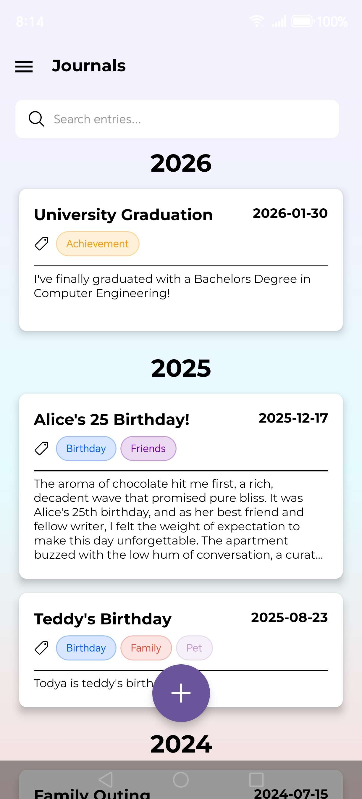
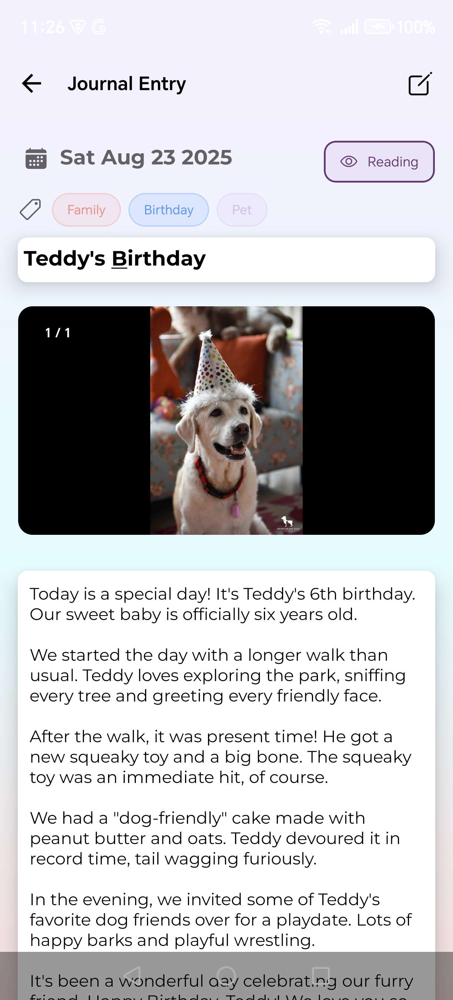
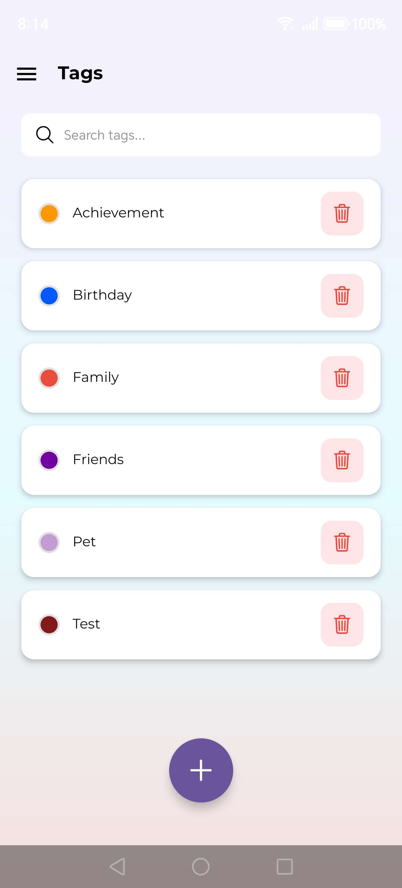
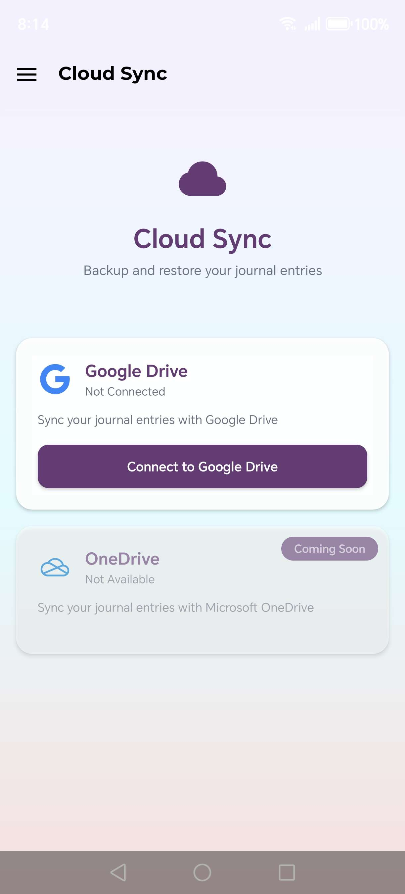
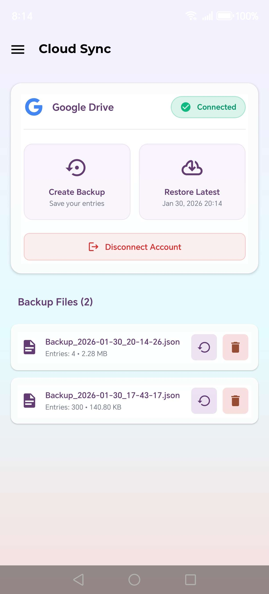
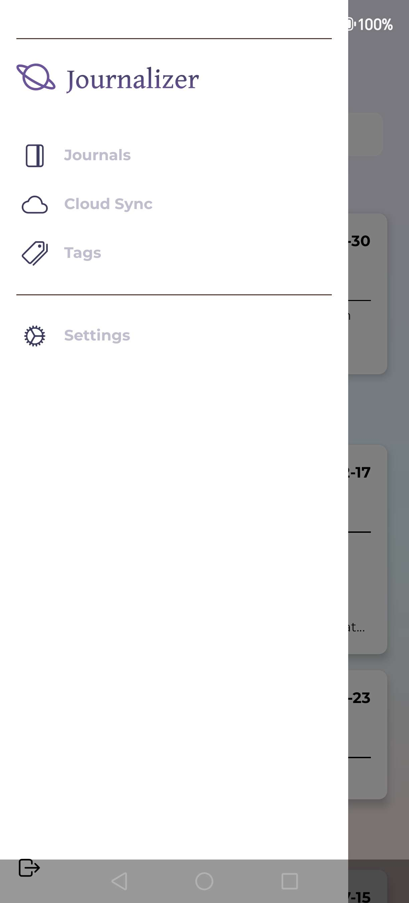
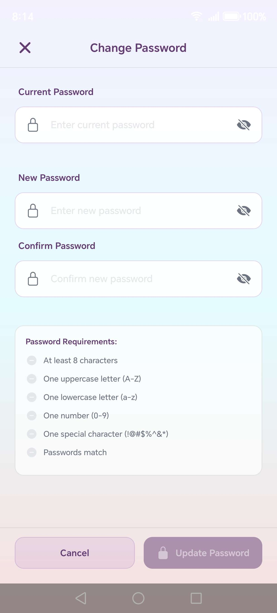
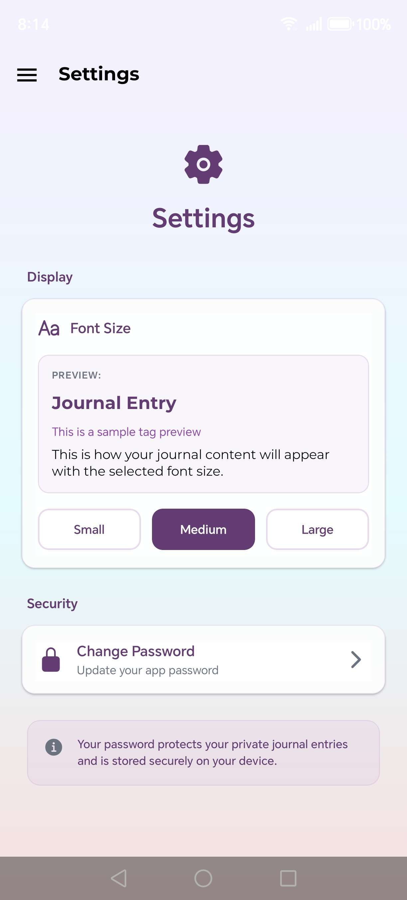

# 📔 Journalizer

A privacy-focused journaling app for Android that keeps your thoughts secure and organized.

## 💡 Why Journalizer?

In an age where everything is cloud-synced automatically, Journalizer takes a different approach. Your journal is personal, and you should have complete control over where it lives and who can access it. That's why I built Journalizer with local storage first, giving you the option to backup only when you choose to.

## 📸 Screenshots

  
  
  
  
  
  
  
  

## ✨ Features

### 🔒 Privacy First
- **Local Storage by Default** - All your journal entries are stored locally on your device, ensuring your private thoughts stay private
- **Optional Cloud Sync** - Sync only when you choose to, maintaining full control over your data

### 📝 Journaling
- **Rich Text Entries** - Write detailed journal entries with timestamps
- **Multi-Selection Mode** - Long-press to select multiple entries for batch operations
- **Search Functionality** - Quickly find entries with powerful search with date, tag, and title filtering
- **Date Organization** - Entries organized chronologically for easy browsing

### 🏷️ Organization
- **Custom Tags** - Create and assign tags to categorize your entries
- **Tag Management** - Add, edit, and delete tags with ease
- **Tag Filtering** - Filter entries by tags to find related thoughts
- **Color-Coded Tags** - Visual organization with customizable tag colors

### ☁️ Cloud Backup (Optional)
- **Google Drive Integration** - Optionally backup entries to Google Drive
- **Individual Entry Backup** - Backup selected entries or all entries at once
- **Easy Restore** - Restore from a specific backup or restore from the latest backup
- **Merge-Friendly** - Restored entries merge with local data, keeping local-only entries intact
- **End-to-End Encrypted** - Files encrypted on cloud with AES-256 encryption before upload

### 🎨 User Experience
- **Clean Interface** - Beautiful gradient themes with intuitive navigation
- **Smooth Navigation** - Drawer navigation for quick access to all features
- **Offline First** - Works perfectly without internet connection
- **Customizable Font Size** - Adjust text size (Small, Medium, Large) directly from Settings

## 🔐 Privacy & Security

Journalizer prioritizes your privacy:

- **No tracking** - No analytics or user data collection
- **Open source** - Full transparency in code and data handling

### 🔒 Password Protection & Encryption

#### App Password
- **Password Protection** - Set up an app password in Settings to protect your journal entries from unauthorized access
- **Strong Password Requirements** - Passwords must meet security standards
- **PBKDF2 Hashing** - Passwords are hashed using PBKDF2 with 1,000 iterations and a fixed salt for deterministic hash generation
- **Secure Storage** - Password hashes are stored securely in the device's secure storage (Secure Enclave on iOS, KeyStore on Android)

#### Cloud Backup Encryption
- **End-to-End Encryption** - When you backup entries to Google Drive, they are encrypted before upload
- **Deterministic Encryption Key** - The encryption key is derived directly from your app password hash, allowing you to restore backups after app reinstall or across devices with the same password
- **AES-256 Encryption** - Backups use AES-256 bit encryption in CBC mode for maximum security
- **Random IV** - Each backup uses a cryptographically random 128-bit Initialization Vector (IV) to ensure identical data produces different ciphertexts

#### Security Best Practices
- Your password is never transmitted to external servers
- Only encrypted backups are uploaded to Google Drive
- All cryptographic operations use industry-standard libraries (CryptoJS)
- After reinstalling the app, use the same password to restore your encrypted backups

## 🚀 Getting Started

### Prerequisites
- Android device (API 21+)
- (Optional) Google account for cloud backup feature

### Installation
1. Download the APK from the releases page
2. Install on your Android device
3. Start journaling!

### Cloud Sync Setup (Optional)
If you want to use the Google Drive backup feature:
1. Open the app and navigate to Settings > Cloud Sync
2. Tap "Connect to Google Drive"
3. Sign in with your Google account
4. Grant permissions
5. You can now selectively backup entries

## 📱 How to Use

### Creating an Entry
1. Tap the "+" button on the Journal screen
2. Write your entry
3. Add tags (optional)
4. Save

### Multi-Selection Mode
1. Long-press any journal entry
2. Tap other entries to select multiple
3. Use the action buttons to:
   - Delete selected entries
   - Backup selected entries to Google Drive
   - Cancel selection mode

### Backing Up Entries
1. Select entries using multi-selection mode, OR
2. Go to Cloud Sync screen and tap "Create Backup" to backup all
3. Your entries are saved as individual files with titles and timestamps

### Restoring Entries
1. Go to Cloud Sync screen
2. View your backup files
3. Tap the restore icon on any backup to restore it
4. Or tap "Restore Latest" to restore latest backup at once

## 🛠️ Built With

- React Native & Expo
- SQLite for local storage
- Google Drive API (optional integration)
- React Navigation

## 📄 License

This project is licensed under the MIT License - see the LICENSE file for details.

## 🤝 Contributing

Contributions are welcome! Feel free to open issues or submit pull requests.

---

Made with ❤️ for privacy-conscious journalers
